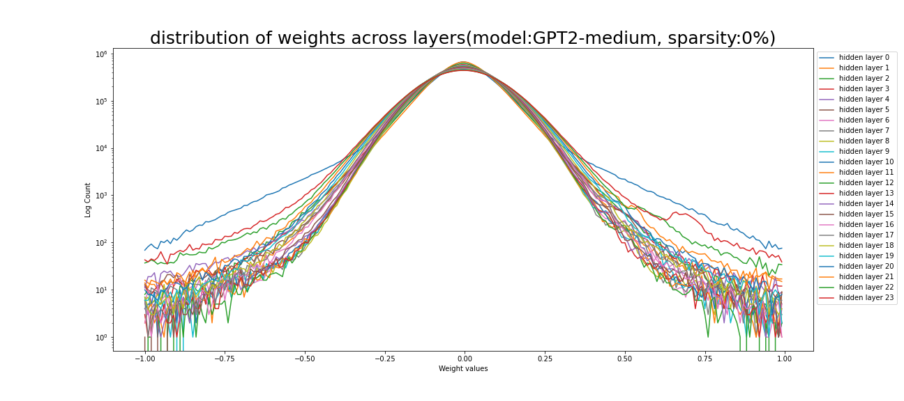
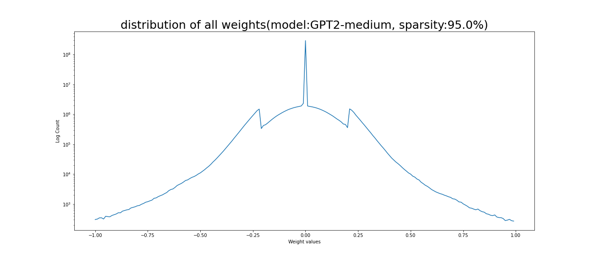
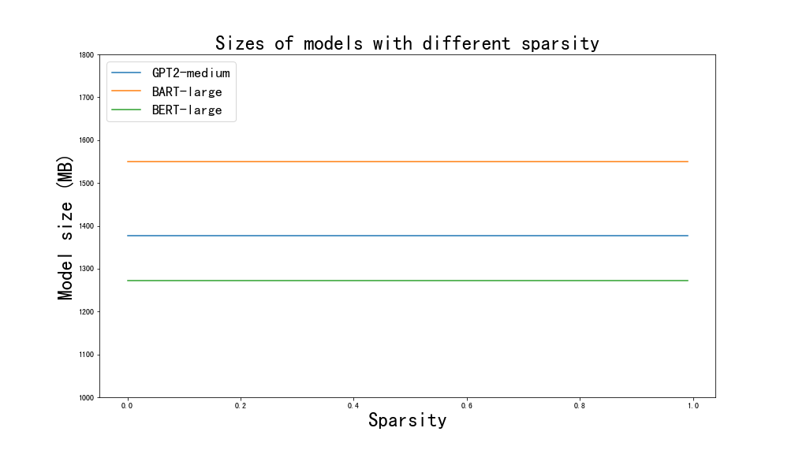
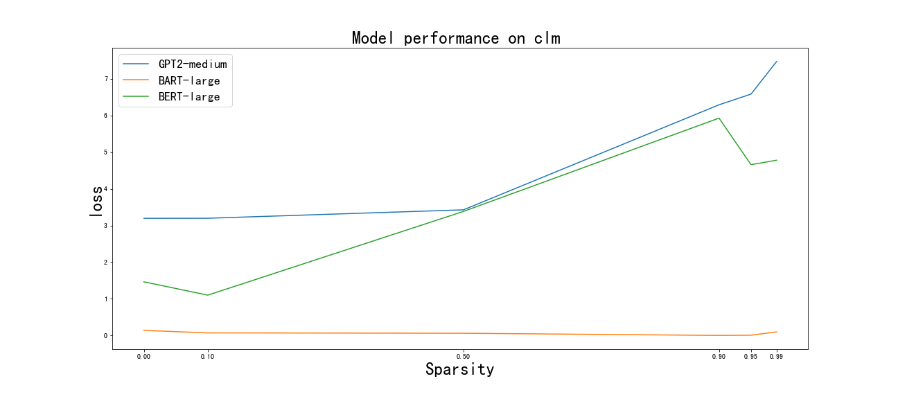
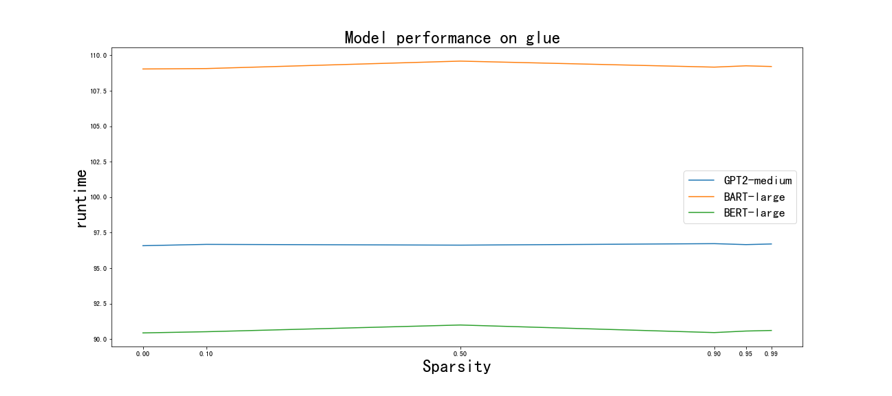

# Lab4 LLM Sparsification

## Concepts

* Sparsification: Making the network sparser by assigning zero weights. The model size may not be reduced. 
* Pruning: Removing some weights of the mode. The core idea is to reduce model size
* Quantization: Use lower precision FP for computing in the middle steps. 
* Distillation: Transferring knowledge from larger models to small ones so that student models could learn faster and better. 
* MoEfication:  Partitioning models as different experts and only activating some parts of them when having an input. 

## Model Selection:

* D-0: GPT2-medium
* E-D: BART-large
* E-0:BERT-large

At first I chose GPT-2-xl for the Decoder only type. GPT2-XL works well for benchmark testing, but it's too big to store on the disk on Argonne's personal directory. So we use GPT-2 medium instead.

For the E-D and E-o type I used Pangu $\alpha$ 2.6B( [Intro from Huawei](https://www.huaweicloud.com/product/modelarts/pangu.html) ) and erlangshen 1.3B( [Intro from IDEA](https://huggingface.co/IDEA-CCNL/Erlangshen-MegatronBert-1.3B)) first. However, the structure of Chinese language models is really weird.  And they're not well supported by huggingface and `transformers` API. Too many bugs. Though I can sparsify them, I can’t use the unified `transformers` API to call the model for benchmark testing like sequence classification. 

Another consideration of choosing these three models is that all of them have the same number of layers: 24. So they’re of similar size and performance. 

## Model Visualization 

Actually, what I want to say is that I first sparsified those large Chinese language models, I found that the distribution for models having billions of parameters is kind of different from models having millions of parameters: **The developers did some sparsification for those models**. I guess it’s because otherwise  they’re too time-consuming to compute. Here I only present weights distribution of GPT-2 medium, BART-large, BERT-large. 

Models of different types vary, but there are two general conclusions:

* Most parameters are close to 0
* The parameter distribution of each layer is similar to the overall distribution, but higher layers tend to deviate from this pattern. 

## Model Sparsification & Sizes

vis_layers_params_GPT2-medium_sparsity_0_I used `L1Unstructured` from pytorch pruning for model sparsification. This method prune weights unstructurally and globally, with a L1 norm. Weights that are close to 0 are more likely to be pruned.  See examples below. See more sparsification results in the `figs` folder. 

### Model size change

The pruning method we adopted only change a portion of weights to zero, and these zeros are stored as other weights. So the model size doesn’t change. However, as there’re more zeros in the model, we can use compression methods to compress those model. 

## Results on Benchmarks

The first benchmark we used is Causal language modeling(CLM). LMs are fine-tuned on the wikitext corpus. The other one we used is glue. Specifically, we used the `qnli` subcorpus, which focuses on whether an answer is an entailment to the question. The testing result of CLM is evaluated using loss(or perplexity ) on the eval set. The testing result of glue is evaluated using accuracy on the eval set. Runtimes of models of different sparsity are also compared, using the computation time on training set. 

For three models, we can see a decrease in performance as the sparsity level increases(except for BART-large in CLM test), which is understandable. For BERT-large on glue benchmark, its performance even increased a bit after pruning 5% of weights. 

As for runtime, we can’t significant changes as the sparsity level changes. The improvement is negligible comparing to the magnitude of weighted pruned. 

## CLM

## GLUE(qnli)

## Challenges of LLM sparsification

I think the biggest challenge for LLM sparsification is to do sparsification without compromising its performance. As we can see from previous results, the arbitrary pruning method we chose couldn’t achieve this goal. Take the `glue` test for example, the model was almost guessing when 50% of its weights are pruned. (Admittedly, partially its also caused by the training parameters. I only selected 5000 training samples and 1 epoch). Hence, how to keep the performance as good as the un-sparsified one or even better is of critical importance. And since many works prove that the size of the model is even more important to the model performance compared to the architecture for the rich information its weights carry, we can imagine the problem of balancing the sparsification level and model performance will be challenging. 

sidenotes: Other kinds of challenges I think may present

1. Size. LLMs are too large to operate. They’re even difficult to deal with using cloud resources. So that only big tech companies/organizations have the ability to develop and deploy them. Again, this highlights the importance of reducing model sizes. It’s not directly related to sparsification, but sparsification could facilitate model compression.  
2. (Standards). This is for Chinese LMs. The API for calling them is kind of incompatible with the current framework, which may be a barrier for the development of Chinese LMs. This issue may also exist in other non-English LMs. 

